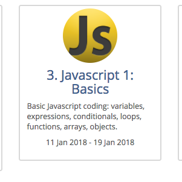
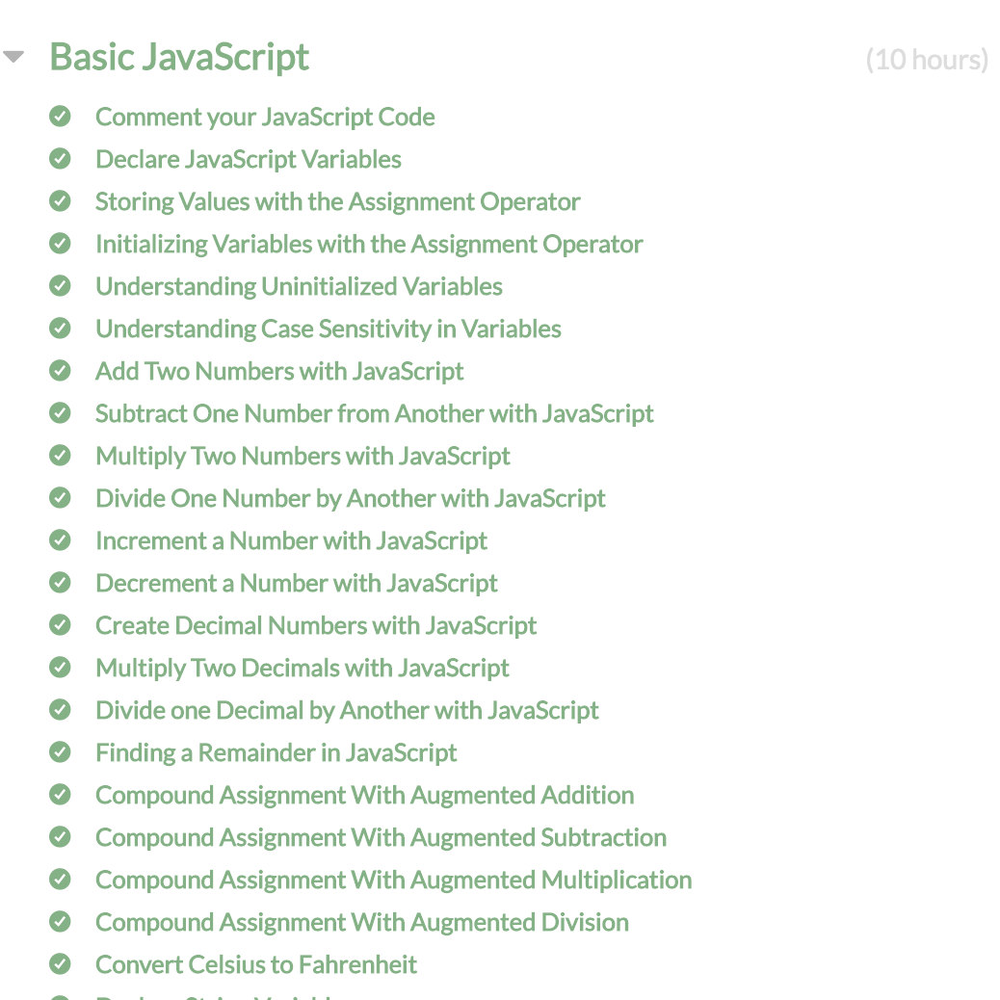

At the moment, I am taking a course on Software Engineering from UH Manoa's Information and Computer Science Department. It is the first week of class and we have already began our 3rd module: Javascript Basics. Appropriately named, the Javascript Basics module is intended help us student become competent with elementary Javascript. The goals are to be able to use basic Javascript constructs such as variables, functions, conditionals, loops, arrays, objects, implement object orientation using the ES6 class construct and use the Underscore library to program in a functional manner.

This is the first time I am being formally introduced to Javascript. I am currently in my 8th semester as a Computer Engineering student, so I am aware of its ubiquity on the web and am eager to learn. 

My experience is mostly with languages such as C, C++, and Java. As it was explained to me by my professor, Dr. Phillip Johnson, the languages Java, C, and C++ stem primarily from Assembler and interacting with the physical registers and memory in the computer while Javascript "comes from much more abstract notions about computation". So I am expecting Javascript to be a higher level programming language than what I am used to.

So far I have completed the FreeCodeCamp basic JavaScript exercises. This basic JavaScript module includes 106 exercises to introduce the syntax and basics of programming with JavaScript. I also have started reading sections of the ES6 for Humans book available [here](https://github.com/metagrover/ES6-for-humans). I have read the section on let, const and block scoping, as well as for...of vs for...in. 

So far 

I am now starting to take a Software Engineering class. I hope to learn a lot through the course, but I know it will be just the beginning of my journey. By the time I’m done with it, I hope I’ve learned enough to take the next step in my life as a developer. But until then, my fire will keep on burning.

