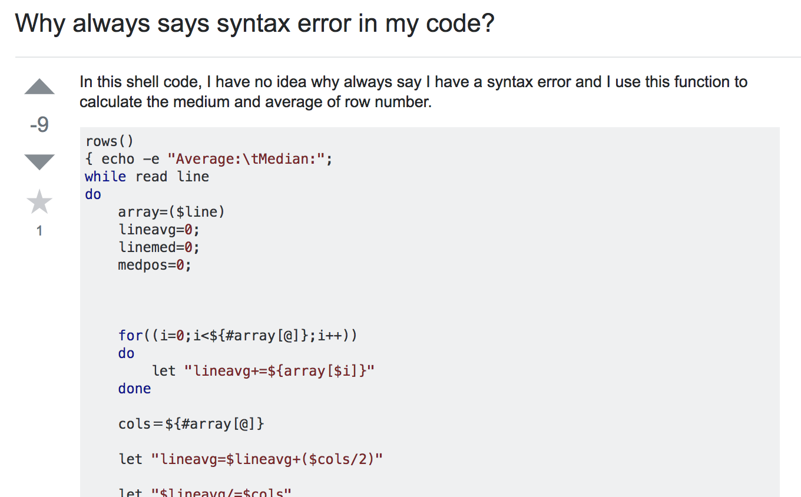
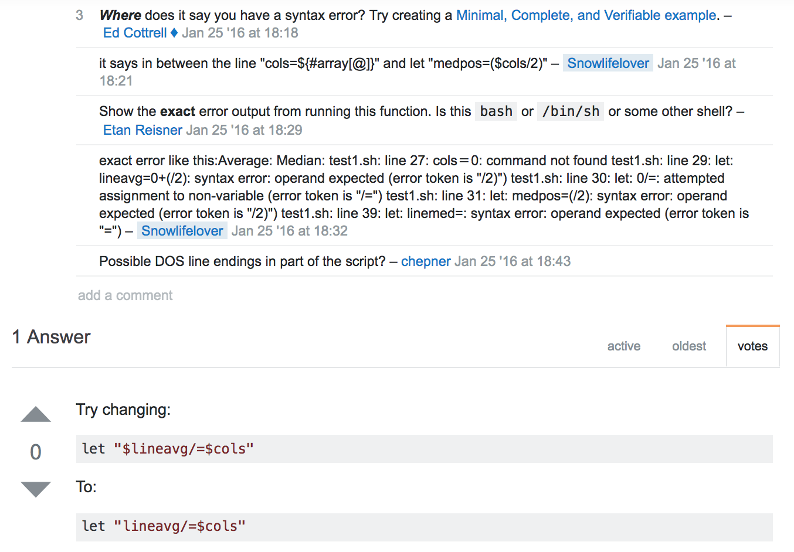
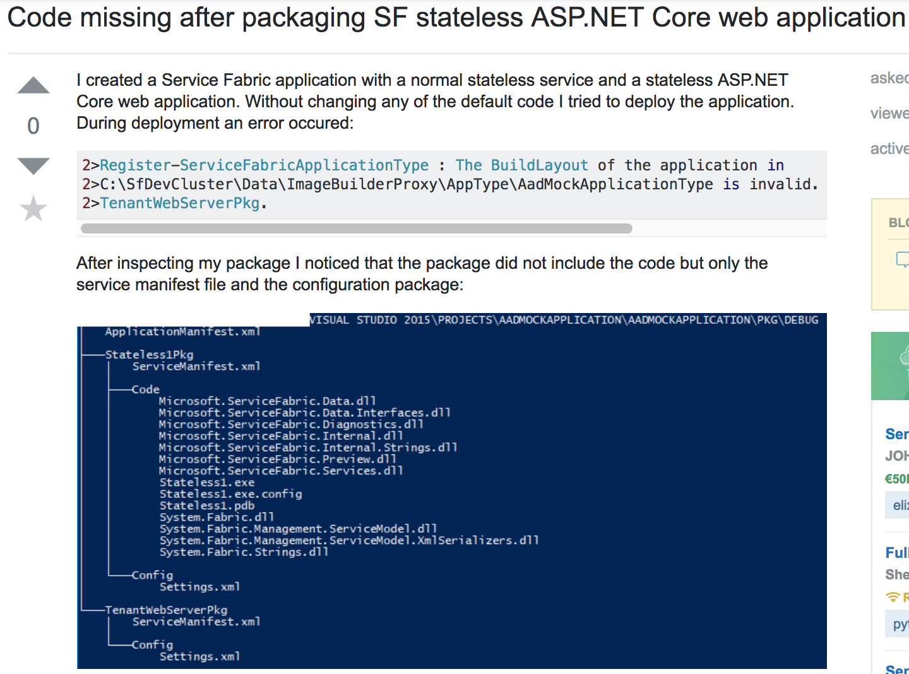
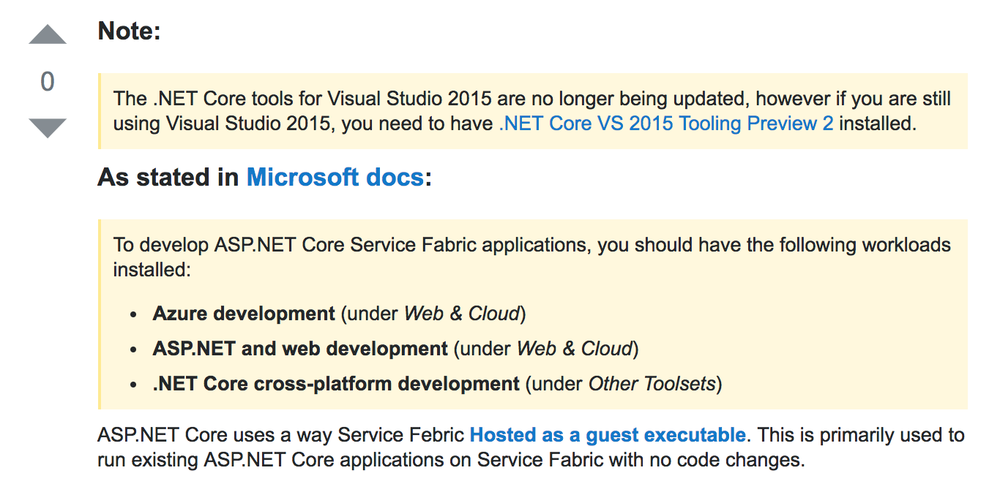

It turns out, contrary to what Mrs. McGillicuddy promised us in grade school, that there are such things as Stupid Questions! (Well at least stupid ways to ask them.) 

Eric Steven Raymond provides a guide to communicating with hackers, like himself, in his essay "How To Ask Questions The Smart Way". Raymond clarifies what the smarter, smart, and stupid ways to ask questions are. 

He leads with an introduction for the reader, warning of the blunt tone he and the open source community share, not to be interpreted as arrogant, but rather necessary for efficiency. He goes on to explain that the experts that are answering questions are doing us a favor, they are sharing their hard earned wisdom with those in need. These experts are also typically very busy people, and therefore their time and effort should be respected. If you put little to no effort into researching your problem or designing your question before you start asking others for help, then you should not expect a quality answer. 

## How To Ask A Stupid Question ##

Raymond defines ways to properly identify stupid questions. Let us analyze a real life example to gain a better understanding. 

I was so delighted to find this question on the popular site Stack Overflow. This question has many of the traits Raymond refers to in his article and we have a lot to learn from it.

Let us begin with the subject header: "Why always syntax error in my code?". Reading this subject header alone tells us... next to nothing, I have no idea what to expect besides messy code. This question is not interesting either, a hacker looking to solve a thought provoking problem would not blink twice at this post before carrying on with their day.

Next we continue to read the full problem description in our example, it states "In this shell code, I have no idea why always say I have a syntax error and I use this function to calculate the medium and average of row number."

Raymond puts it best when he points out, "We've found by experience that people who are careless and sloppy writers are usually also careless and sloppy at thinking and coding (often enough to bet on, anyway)... So expressing your question clearly and well is important. If you can't be bothered to do that, we can't be bothered to pay attention."

Hackers in the open source community respect effort. This description is unclear and written carelessly, it tells us that the person put little to no thought into trying to solve the problem on their own and spent no energy writing the question. If it is difficult to understand the problem then it difficult for someone to actually help.  

Now this person may be writing the question in English but it is a second language to them, but for this post we are left to assumptions. Raymond suggests that it is a good idea to alert respondents of language barriers and provide options to get around them.

Lastly, we move on to the responses.

To my surprise this question recieved a legitimate response, but not until after some probing.

We see that people had to ask for ellaboration, "Where does it say you have a syntax error? Try creating a Minimal, Complete, and Verifiable example." This is a great suggestion by the way, it is helpful to see an example of the problematic behavior to those trying to solve the problem. Just posting a large block of code directs more work to the hacker trying to help. It is much more efficient to give an example and the person asking the question is now learning how to debug their own code.

## How to Ask A Smart Question##

We have seen the stupid way to ask a question, now lets look at a smart way. Again we will look at an example, but this time hopefully we learn a more effective approach.

This header is concise and grammatical, "Code missing after packaging SF stateless ASP.NET Core web application". I am not expert on this topic but I understand what the deviation is and what tools they are working with. This post already has a good chance of recieving a quality answer. 

The problem description is also efficient. We are told the symptoms and the steps taken to understand the problem in a chronological order, "I created a Service Fabric application ... I tried to deploy the application... After inspecting my package I noticed ... After trying for many hours I noticed... How do I package the web application correctly so the code package is included?". A detailed sequence of events provides clues to hackers that may have initially been overlooked.

We also see examples of error messages and segments of relevant source code, not so much that we get overwhelmed and in a organized way. This description show us that this person is willing to work and ready to solve the problem.

Now lets see a response. 

Now unfortunately this post is still unresolved but this is an example of a quality response with some evidence as to why it might solve the issue. The suggestion, with some documentation to back it up, is to install a package for Visual Studio. 

So we see that quality questions recieve quality answers. I am confident that this question will stay active and be resolved in the near future.

If you want to participate in the open source community effectively I highly suggest learning how to ask questions. Designing a good question takes effort and the process of building your question will develop your own understanding of the issue, sometimes so much so that you no longer need to ask someone else. 

Good luck, and don't be afraid ask questions.
