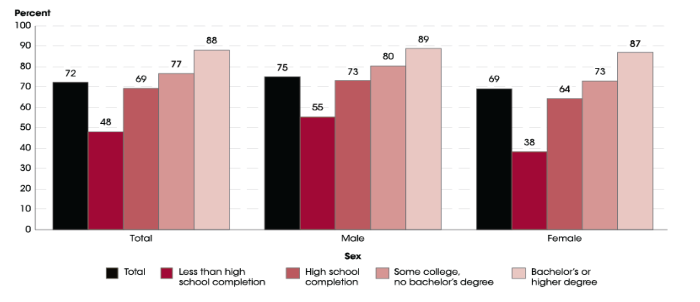

**Lifelong Learning**

**Abstract**

The goal of this essay is to explore lifelong learning, and specifically
its value in the professional development of a computer engineer. We see
many different types of lifelong learning opportunities and specific
examples for engineers. By the end we reach the conclusion that lifelong
learning promotes personal development and is a way to stay competitive
and relevant in the workplace.

1.  **Introduction**

    This paper discusses the ideology of lifelong learning, and
    specifically its pertinence in the professional development of a
    computer engineer.

    To begin, we develop a deeper understanding of what lifelong
    learning is in section 2. We continue with answering the question
    \"Why is lifelong learning important?\" by exploring interesting
    data and case studies in section 3. Finally, we close with a summary
    of the discussion and some concluding points.

2.  **-What is lifelong learning?-**

    Lifelong learning is important to every person, in technology fields
    this is especially obvious. Science and technology is advancing more
    rapidly than ever before, thus it is increasingly important to stay
    up to date if you wish to be a relevant player in your field of work
    or study. There are many different learning opportunities for people
    to participate but they all should have some particular
    characteristics.

      ----------------------------------- ---------------------------------
      -Informal Professional Broadening   -Formal Professional Broadening
      -Informal Professional Focus        -Formal Professional Focus
      -Informal Scholarly Broadening      -Formal Scholarly Broadening
      -Informal Scholarly Focus           -Formal Scholarly Focus
      -Personal Broadening                -Personal Focus
      ----------------------------------- ---------------------------------

    [\[tab:Traits of Learning Opportunities\]]{#tab:Traits of Learning Opportunities
    label="tab:Traits of Learning Opportunities"}

    A lifelong learning opportunity should either widen your current
    scope of understanding (broadening) or dig deeper into what you
    already have experience with (focus). We will explore some specific
    examples of lifelong learning opportunities for engineers.

    The institute of Electrical and Electronics Engineers is a
    professional association which hosts technical conferences where
    some of the latest advancements in a specified field are presented.
    A list of their planned conferences is available on their website
    [www.ieee.org](www.ieee.org) [@IEEE; @Conferences]. This is an
    example of a learning opportunity that is beneficial to scholarly
    broadening and scholarly focus. Going to a conference on something
    that is outside your current field of expertise will widen your
    scope and help you make connections to those studying or working in
    another area. It could also potentially provide insight into
    approaching a problem in your own work in way you would have never
    thought to do otherwise. If the conference is related to your
    current focus, then you can stay up to date on the latest
    advancements and strengthen your current skill set.

    Taking graduate courses on material that you feel is relevant to
    your career is another great learning opportunity for engineers. For
    example, if you are a working as a software engineer and see that
    there is a growing need for people with an understanding of machine
    learning, then you can apply to register for courses at a local
    college or university. UH Manoa offers graduate courses in the STEM
    fields and the Electrical Engineering department of the College of
    Engineering has a website [www.ee.hawaii.edu](www.ee.hawaii.edu)
    with information on graduate programs and specific courses
    [@UH; @Manoa; @Electrical; @Engineering]. This is an example of a
    learning opportunity with the trait of formal scholarly focus;
    taking a graduate course will provide you with thorough knowledge of
    a subject.

    Maybe you don't have the time during the week to take classes in
    person with a local university or college but you still want to dig
    deep into some topic. One solution would be to find an online
    course. MIT hosts a website, [ocw.mit.edu](ocw.mit.edu), of some of
    their popular courses you could follow for free. For example, if you
    wanted to learn about discrete stochastic processes you can watch
    video lectures, read class notes, complete assignments and exams all
    from home using MIT's open course ware website
    [@MIT; @Open; @Course; @Ware]. This could be used as both informal
    scholarly broadening and focus depending on your motivation and
    intentions.

    Perhaps MIT open course ware does not have a course covering the
    material you wish to learn about. In this case we can revert to the
    classical solution of finding a well written book on the topic. Back
    to the example of machine learning for its relevance and the
    abundance of quality resources on the topic. Finding a good book on
    machine learning takes simply a Google search. Once you have found
    an appropriate book on machine learning I recommend researching the
    authors of the book to verify their credibility. I have found a book
    on machine learning by credible authors that is available for free
    online titled *Understanding Machine Learning: From Theory to
    Algorithms* by simply querying Google search \"machine learning
    book\" [@Machine; @Learning; @Book]. This is yet another example of
    scholarly focus as well as broadening depending on the rigour of the
    text and your own focus.

    There are also less specific opportunities for lifelong learning
    that are often times even more useful than finding a good material
    resource to read or watch. A perfect example of this would be
    finding a mentor. A mentor should be a person who has experience and
    a shared interest with the field of work or study you are in. A
    mentor should also be a person who you can have a comprehensive
    discussion with. The benefits of having a quality life long mentor
    are countless. They can help guide your learning because they begin
    to understand the way you think and what your level of understanding
    is. They can provide you with professional opportunities by
    connecting you with others in the vast technology community. A
    lifelong mentor could be a professor, an accomplished peer, or
    perhaps a company leader at your place of work. Having a mentor
    takes on almost all characteristics of what a learning opportunity
    should be and is arguably the most important learning opportunity I
    will suggest.

    Strengthening your credentials is a great way to grow as a
    professional. Having a certification verifies to employers your
    qualification for a job. Whether you are applying to a new company
    or working your way up, having a license shows you are skilled and
    focused. Specifically for engineers, there are professional
    engineering exams you can take from the National Council of
    Examiners for Engineering and Surveying to become a licensed
    engineer. To be qualified to take these exams you must have a
    certain number of years of experience as a practicing engineer and
    there are different levels of certification. Obtaining a
    certification is an example of a formal professional focus learning
    opportunity.

    Networking with others in the tech community is invaluable, it will
    open up opportunities that you may have known existed. A great way
    for any professional to network is by finding and participating in
    events that are related to your work. For computer engineers that
    may be tech conventions, hackathons, or luncheons. A good way to
    find these events is by looking them up online. This learning
    opportunity is one that will help your informal and formal
    professional broadening.

    Participating in open source projects is an excellent way to earn
    experience. Finding a project that sparks your curiosity may be
    difficult, if you have no luck with the many existing open source
    projects out there then you can very easily start your own.
    Experimenting with these projects is a good way to find what you
    truly enjoy. Open source projects receive a lot of constructive
    criticism as they develop, and you can use that criticism as a
    learning opportunity. This is a good way to network as well.
    Contributing to an open source project will introduce you to other
    software engineers with connections of their own. For those reasons
    this learning opportunity has the traits of informal professional
    broadening and focus and personal focus.

    Being present within the company you currently work for is only
    beneficial. By present I mean participating in extra company hosted
    events, volunteering to take on more responsibilities and being
    socially approachable to others. This behavior is a lifelong
    learning strategy since it opens up your daily bubble of
    experiences, rather than sticking to a routine. This is a lifelong
    learning opportunity with the strongest trait of formal professional
    broadening.

    The last lifelong learning opportunity that I will suggest is my
    personal favorite. I believe traveling is a fantastic way to learn.
    Traveling, whether it be for business or pleasure, can foster new
    professional connections and inspire original ideas. This lifelong
    learning opportunity is one with personal focus and broadening
    aspects since it can break you out of your comfort zone and expose
    you to new experiences.

3.  **-Why is lifelong learning important?-**

    Lifelong learning is a necessary element of progress. By progress I
    am referring to both personal and societal. Three reasons lifelong
    learning is important are lifelong learning is positively correlated
    to employability, income, and your health .

    Being a lifelong learner is will increase your chances of getting a
    new job as well as keeping your job. A lifelong learner gains new
    skills and stays relevant to the workplace, keeping up with the
    advancements of technology. You do not want to be replaced a
    newcomer who is willing to learn what you can do and more or, even
    worse, by an autonomous system.

    To prove my point that lifelong learners are more employable lets
    take a look at some interesting statistics. The National Center for
    Education Statistics looked at the employment rates of 20 to 24
    year-olds, by sex and educational attainment in 2016
    [@Employment; @Rates]. The results of this study can be seen in
    figure [1](#fig:EmploymentRates){reference-type="ref"
    reference="fig:EmploymentRates"}.
    
    

    Now this is a study only looking at 20 - 24 year olds, but this
    illustrates an almost undeniable trend, higher education means
    higher chance of finding a job. This is not only important when you
    are in your early 20's finding a job out of college, you may need to
    find a new job every 4 years! according to the Bureau of Labor
    Statistics [@Job; @Changes].

    Jobs are becoming modernized and workers have to adapt. The
    Economist reports

    \"Coding skills, for example, are now being required well beyond the
    technology sector. In America, 49% of postings in the quartile of
    occupations with the highest pay are for jobs that frequently ask
    for coding skills.\"

    More and more quality job postings require technical skills.

    So if you have are a lifelong learner then you are more likely to
    stay employed, but we also want to be properly compensated. The
    Bereau of Labor Statistics reports that the average Computer
    Scientist makes \$111,840 per year and the average Computer Hardware
    Engineer makes \$115,080 per year [@Computer; @Scientist; @Income]
    [@Computer; @Engineer; @Income]. This is much better than the median
    income per capita the USA of \$31,099 [@Income; @Per; @Capita]. So
    we can see that higher skilled jobs realize much more compensation.

    Lifelong learning is not only good for your career but also your
    personal health. Studies have shown that social and mental activity
    can delay symptoms of Alzheimer's [@Alzheimer's] and learning new
    skills at an old age can keep your brain sharp and fight off
    dementia [@dementia]. So lifelong learning can arguably lengthen the
    life your career and increase your quality of life at old age.

4.  **Conclusions**

    Lifelong learning promotes personal development and is a way to stay
    competitive and relevant in the workplace. We saw many different
    types of lifelong learning opportunities, professional, personal,
    and scholarly, and examples of each, specifically for Computer
    Engineers. Because of its importance I want to reiterate that a
    lifelong learning method should either widen your current scope of
    understanding(broadening) or dig deeper into what you already have
    experience with (focus).

    Lifelong learning is incredibly important and it is easy to see why
    from employment rates and income of lifelong learners. An even more
    surprising point was that lifelong learning is not only good for
    your career but also your personal health. For these reasons, people
    everywhere in every profession should strive to be lifelong
    learners.

**References**

1. Ieee.org. (2018). IEEE Conferences. \[online\] Available at:
<https://www.ieee.org/conferences_events/index.html> \[Accessed 13 Feb.
2018\].

2. Anon, (2018). \[online\] Available at: <https://www.ee.hawaii.edu>
\[Accessed 13 Feb. 2018\].

3. Robert Gallager. 6.262 Discrete Stochastic Processes. Spring 2011.
Massachusetts Institute of Technology: MIT OpenCourseWare,
<https://ocw.mit.edu.> License: Creative Commons BY-NC-SA.

4. Shalev-Shwartz, S. and Ben-David, S. (2014). Understanding Machine
Learning From Theory to Algorithms. 1st ed. \[ebook\] New York:
Cambridge University Press. Available at:
<https://www.cs.huji.ac.il/~shais/UnderstandingMachineLearning/understanding-machine-learning-theory-algorithms.pdf>\[Accessed
13 Feb. 2018\].

5. Nces.ed.gov. (2017). Fast Facts. \[online\] Available at:
<https://nces.ed.gov/fastfacts/display.asp?id=561> \[Accessed 13 Feb.
2018\].

6. Bls.gov. (2016). Employee Tenure Summary. \[online\] Available at:
<https://www.bls.gov/news.release/tenure.nr0.htm> \[Accessed 13 Feb.
2018\].

7. Economist.com. (2017). Lifelong Learning is Becoming an Economic
Imperative. \[online\] Available at:
<https://www.economist.com/news/special-report/21714169-technological-change-demands-stronger-and-more-continuous-connections-between-education?platform=hootsuite>
\[Accessed 13 Feb. 2018\].

8. Bls.gov. (2017). Computer and Information Research Scientists :
Occupational Outlook Handbook: : U.S. Bureau of Labor Statistics.
\[online\] Available at:
<https://www.bls.gov/ooh/computer-and-information-technology/computer-and-information-research-scientists.htm>
\[Accessed 13 Feb. 2018\].

9. Bls.gov. (2017). Computer Hardware Engineers : Occupational Outlook
Handbook: : U.S. Bureau of Labor Statistics. \[online\] Available at:
<https://www.bls.gov/ooh/architecture-and-engineering/computer-hardware-engineers.htm>\[Accessed
13 Feb. 2018\].

10. Amadeo, K. (2018). Americans' Incomes Have Been Falling Since the 1990s.
\[online\] The Balance. Available at:
<https://www.thebalance.com/what-is-average-income-in-usa-family-household-history-3306189>
\[Accessed 13 Feb. 2018\].

11. Park, A. (2015). Puzzles and Brain Games May Not Slow Alzheimer's After
All. \[online\] Time. Available at:
<http://time.com/3916777/alzheimers-symptoms-delay/> \[Accessed 13 Feb.
2018\].

12. Silverman, L. (2014). Learning A New Skill Works Best To Keep Your Brain
Sharp. \[online\] NPR.org. Available at:
<https://www.npr.org/sections/health-shots/2014/05/05/309006780/learning-a-new-skill-works-best-to-keep-your-brain-sharp>
\[Accessed 13 Feb. 2018\].
