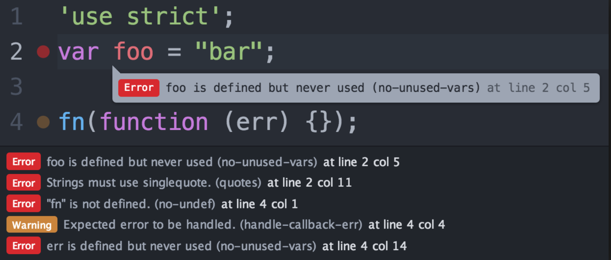

### Why Use Coding Standards? ###
Some may think of conforming to a coding standard to be more of a hassle than what it is worth. I admit subjecting yourself to the constant nagging of a linter utility may not sound very appealing. Recently however, I personally have realized the importance of sticking to a coding style.

### Other People Can Read It! ###
Writing code that is organized and consistent in style is unarguably much easier to read, even if the style does not match your own. If you are reading someone elses code and they are sticking to a coding standard you can, most of the time, pick up on the pattern quite quickly and begin understanding the code before you would if the coding style varied line by line. 

An immediate positive outcome of writing code that is easy for others to understand is it makes for more efficient collaboration. Maybe you are working on an open source project, people are more likely to contribute to your project if they can understand it. Maybe you have a bug and ask a peer to take a look at your code; don't you want to make their life easier? 

### You Can Read It! ###
Suppose you haven't looked at specific file that is a part of a large project for a while. Maybe you come back to it with a great idea for a new feature. You begin tracing it so you can fit your idea in somewhere and... it becomes a horryfing headache; the code is a mess! What could have taken 1 hour to implement now takes 10 hours. Don't you wish you stuck to a clear coding standard? 

The investment made at the beginning of a project to set up your linter to hold you to a coding style will end up saving you time and effort. 

