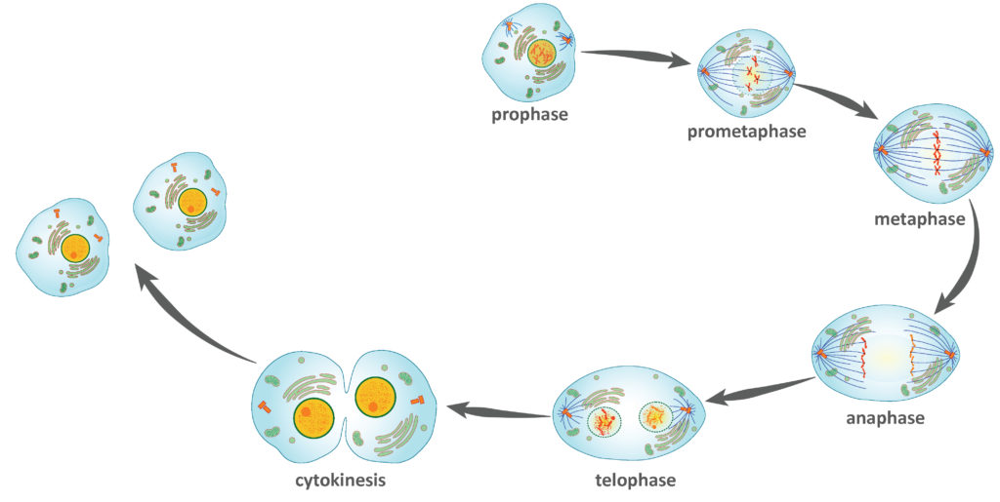

There are some common issues that software developers encounter when designing a system. These issues arise wearing a slightly different mask depending on the application, but experienced software engineers have learned how to identify them and have come up with effective solutions. These solutions are called design patterns. 

To illustrate how useful it is to recognize where a design pattern can be implemented to solve an issue let us refer to the daily productivity of 2 programmers both working to satisfy the same requirements as specified by a customer. Roger is an inexperienced programmer and does not know about design patterns while Lucie is very familiar with the development paradigms.

## Creational Design Patterns: ##

Creational Design patterns are intended to effectively instantiate new objects and classes. Two different ways to achieve an efficient creational design pattern is via class inheritance and or object delegation. 

### Example: Protype ###

Roger and Lucie are both tasked with implementing a system in which instances of an object may be quickly created to hold information, some of which is stored in a DB. The information needed to build the objects that is stored in the DB is costly to retrieve but only takes on a few different values.

Roger understands the problem and decides to take the brute force approach. He simply creates an ad hoc class with a constructor which performs the necessary database operations. Every time an instance of the object is created the database operations are performed. His method works but many instances need to be created, and since accessing the DB is costly his system does not scale and has poor performance.

Lucie also understands the problem but recognizes that the necessary DB operations needed to create instances can be completed 1 time only for every variation on that information retrieved from the DB. She wisely decides to implement the Protype design pattern. She creates 1 abstract class, from which concrete classes will be created for each variation on the DB information retrieved. Then she creates a cache class which holds instances of the concrete classes, these are the prototypes in her protoype design pattern. The cache class has a get method which will return clones of the prototypes that are created without running the costly DB operations. Her system, although slightly more complicated than Bobs, cuts down on DB operations which increases scalability and performance. Lucie's customers are very happy. 

## Conclusion ##

Lucie was able to identify the problem and its complexities and remembered that it would fit well into a design pattern she had seen before. This allowed her to implement an  efficient solution in a reasonable amount of time rather than working through the problem in a brute force way like our friend Roger and realizing unsatisfactory results. 
