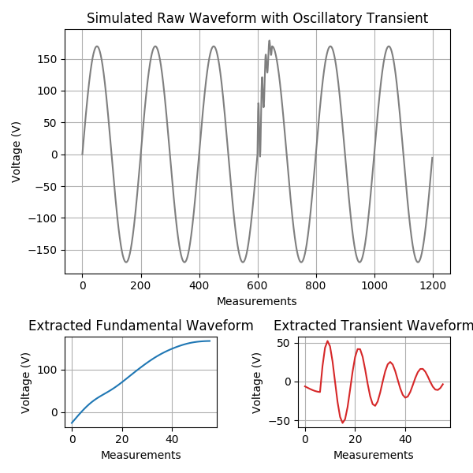
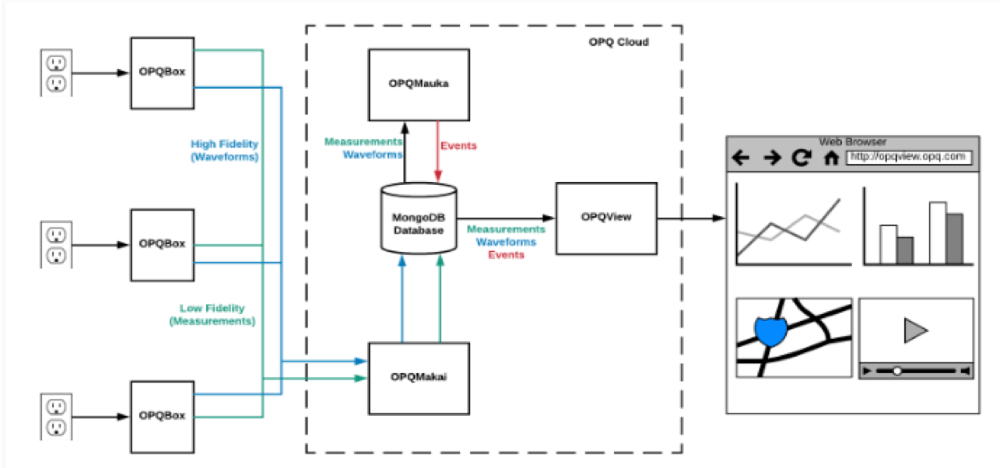

Successfully maintaining adequate power quality and providing sufficient amounts of it to meet the rising needs of consumers has been a triumph of electrical utilities for over 100 years. In recent times, however, there have been changes to the nature of electrical generation and consumption that make power quality of increasing public concern and interest.

The Open Power Quality (OPQ) project began in 2012 with the goal of developing and evaluating technology to support three important improvements to electrical infrastructure:

  1: Increase the capacity of small and large electrical grids to employ distributed, intermittent forms of renewable energy.

  2: Gain insight into lifespan and failure rate problems in consumer electronics due to poor power quality.

  3: Provide an independent, low cost source of useful power quality data to consumers, researchers, and public policy makers.

At the 10,000 foot level, the OPQ system architecture is extremely simple: OPQ Boxes are plugged into outlets, they monitor the quality of power, and the results are communicated via the Internet to a software system called OPQ Cloud. To see the results, users login to the system using a browser.

At a closer look, the OPQ system architecture consists of four major open source hardware and software components that provide end-to-end support for the capture, triggering, analysis, and reporting of consumer level local and global power quality events.

  1: OPQ Box is a hardware device that detects the electrical waveform from a standard residential outlet.

  2: OPQ Makai monitors incoming low fidelity data from OPQ Boxes, requests high fidelity data when necessary, and stores the results in a MongoDB database.

  3: OPQ Mauka analyzes data and creates “incidents” when it detects power quality incidents.

  4: OPQ View is a visualization platform for displaying the results for data capture and analysis.

I am working on the OPQ Mauka component. I have developed plugins to classify different types of frequency disturbances and transients using digital signal processing and machine learning techniques.

To classify transients I have implemented decision tree algorithm. The benefit of this approach is that it minimizes unnecessary computation. As power quality features are mined from the signal, the potential classes that it could fall into are narrowed. Computationally expensive analysis can be bypassed if simple features can rule out a class early in the process. Once the signal is classified, then additional meta data can be computed that appropriately detail the transient. The plugin I have implemented can so far classify five different types of transients.

To learn more about this project please visit our organization's webpage, [openpowerquality.org](https://openpowerquality.org/).
