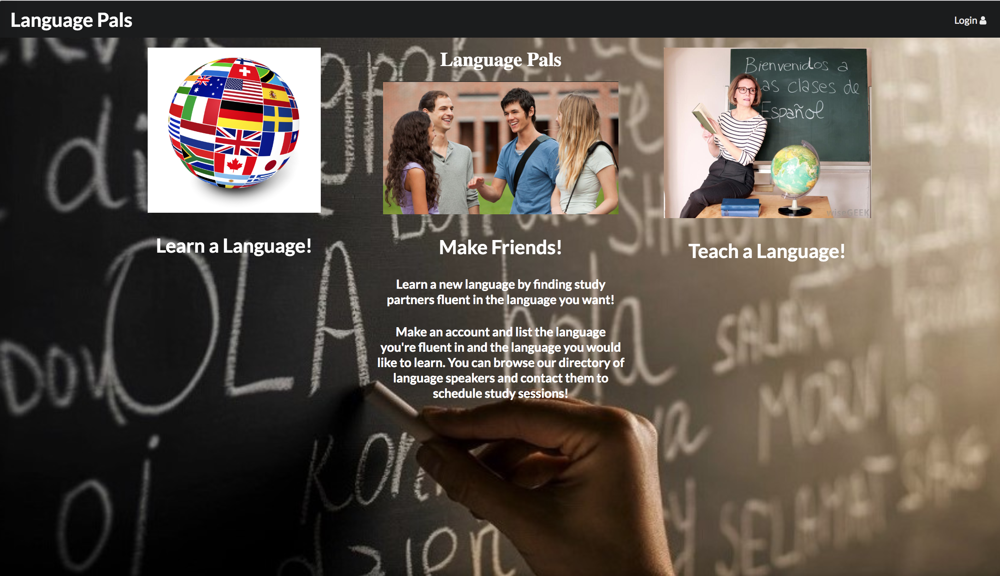

Language Pals is a web application that was develop by myself and a team from the Computer Science department at UH Manoa.

Most importantly, this project allowed us to practice design using the Meteor Framework and taught us how to use some practical project planning techniques. Also, we became competent with elementary Javascript, used configuration management tools and techniques effectively, efficiently created software that conforms to standards, and learned how to design and implement web pages using HTML and CSS.

Please visit the project's home page which describes the app in detail and documents the design process, it is available [here](https://languagepals.github.io/).

The source code is available on [github](https://github.com/languagepals/languagepals).
