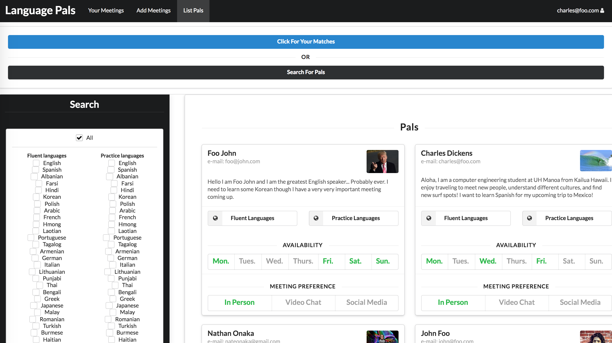
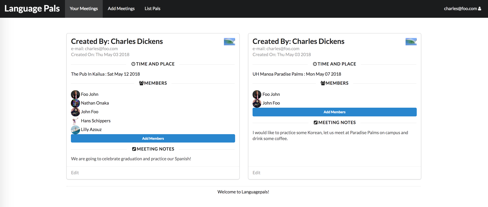

Language Pals is a web application that was develop by myself and a team from the Computer Science department at UH Manoa.

Most importantly, this project allowed us to practice design using the Meteor Framework and taught us how to use some practical project planning techniques. Also, we became competent with elementary Javascript, used configuration management tools and techniques effectively, efficiently created software that conforms to standards, and learned how to design and implement web pages using HTML and CSS.

Specifically what I contributed to the project was designing and implementing the data model, creating components such as the profile and meeting that were used to construct pages, build a simple search feature in the List Pals page, and more.

For the data model we had 3 MongoDB collections: Accounts, Profiles, and Meetings. We utilized Meteor's built in Accounts system to manage and access user id's and passwords in the Accounts collection. After creating an account each user could activate a profile, this profile document was stored in the Profiles MongoDB collection with fields such as owner, which specified the user id the profile corresponds to. The profile's fields could be editted by either the owner or by the application admin. Users can also create meetings in the app to be stored in the Meetings collection. A meeting document holds information such as the creator of the document and the meeting members, which is a user id and an array of user ids respectively. Then the meetings can be viewed or editted by either members or the creator on the list meetings page. 

Please visit the project's home page which describes the app in detail and documents the design process, it is available [here](https://languagepals.github.io/).

The source code is available on [github](https://github.com/languagepals/languagepals).
