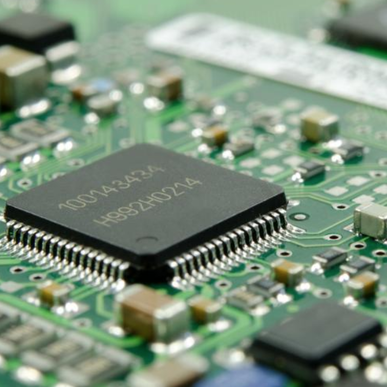

This pipelined processor was designed using Verilog HDL for a Digital Systems and Computer Design lab course (EE361L) I took during the Fall 2017 semester at UH Manoa.

The processor implements a 5 stage pipeline (Instruction Fetch, Instruction Decode, Instruction Execute, Memory Access, and Write Back).

The instruction set supports types Load and Store (data memory access), Computational (register register and register immediate arithmetic), and Jump and Branch (program control including conditionals).

Currently only a single instruction is executed at a time and the next instruction is delayed until the previous instruction is finished processing.

To continue I would add support for branch prediction so there is not a need to stall the processor during a conditional or a branch, instead different instructions can be in the pipeline simultaneously and if a control hazard occurs the processor will catch it and pipeline will be flushed . I would also like to implement a super-scalar architecture, one which supports parallel instruction execution, so multiple instructions could finish processing at the same time.

Source: <a href="https://github.com/dickensc/pipelinedProcessor">github.com/dickensc/pipelinedProcessor</a>
