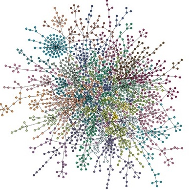
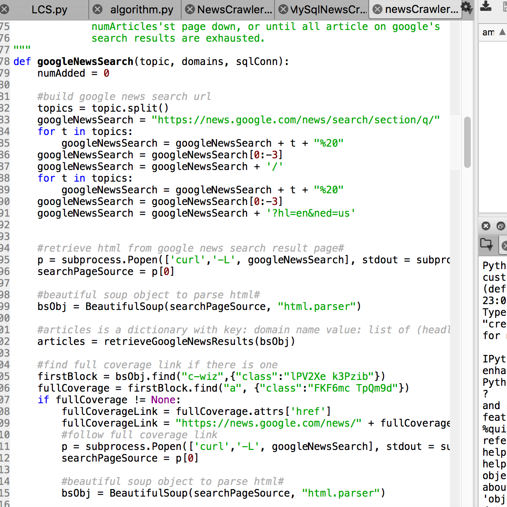

Understanding and modeling modern day information aggregation is the primary goal of this study. Our intention is to provide a quantitative heuristic answer to the question:  Across the internet, how polarized are opinions or information on a topic?

Obtaining information on the web can be modeled with a random walk defined by a Markov process, call it p.Different users with opinions and preferences can be identified by the states of the Markov process they are in; the user’s browsing history can be used to model the starting distribution on p.  Then the polarization of opinion or information covering a topic can be characterized by the mixing rate of p among the different user profiles; the more polarized opinions are the slower mixing p is.

So far I developed a simple web scraper with python script to collect information and opinions relevant to a topic.  This scraper searches Google news for articles and samples a number of the most popular tweets on Twitter.  The goal of the scraper is to capture a glimpse of the larger state space of the Markov process, which is the entire web of news sources and opinions accessible via the internet.

To continue, user browsing histories from different points of view can be collected.  The relevant articles or tweets encountered by the user can be determined by the scraper I built.  The articles and tweets can be profiled as different states then the relevant user browsing history can be represented by a Markov chain from which we can calculate the starting distribution. We can then simulate the user proceeding to browse and encounter articles on the web.  The Markov Chain will grow and the distribution will approach the stationary distribution at a measurable rate.

Source code is avaiable and being updated on [github](https://github.com/dickensc/PolarizationOfInformation).

