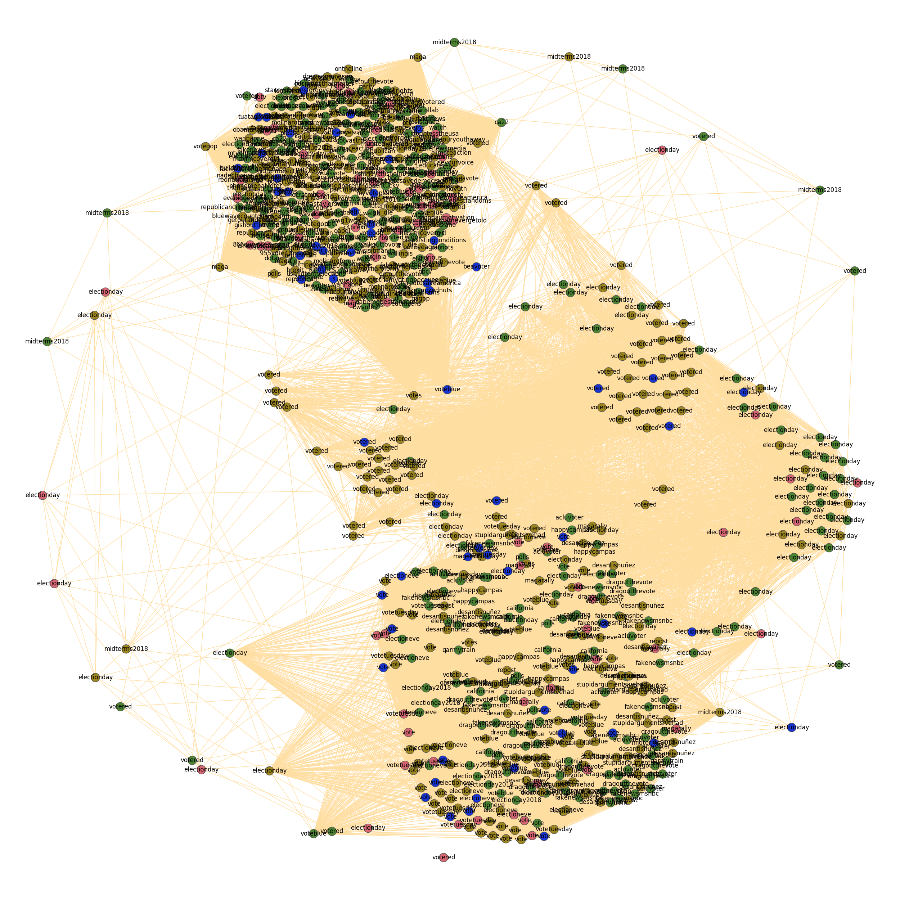
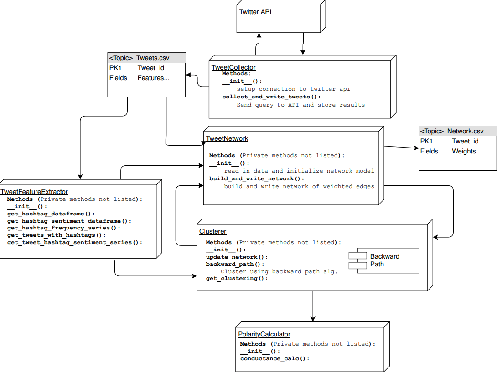

Many sources claim that the political climate is becoming increasingly polarized, but few attempt to quantify this feeling. Furthermore, the strict dichotomy of left vs. right is a simple and typically accepted narrative, but perhaps a more fine grained model which considers smaller schools of thought on a topic to topic basis may better capture what is truly happening on the web. With an objective understanding of the polarization of information on the web, researchers could pinpoint causes, and potentially come up with solutions to reverse this concerning trend and foster more fruitful conversation.

The primary focus of this project is to develop a system that can provide objective measurements of the polarity of the network of information and opinions on Twitter and Google News. We have implemented a semi-supervised approach to modeling the network of tweets with an un-directed weighted graph using a feedback loop which applies a state of the art clustering algorithm that was developed in house at UH Manoa's Big Data lab. Communities of the resulting network are identified and the polarization of the network is then quantified using graph conductance.

Our system has analyzed multiple topics of discussion and has identified groups that align with our intuitions. The network structure including polarity calculations can be successfully measured and compared across topics. Future work on this project will be to incorporate more features into the methods for building and weighting the network of information.

Source code is available and being updated on [github](https://github.com/ThePolarizationOfInformationOnTheWeb/ThePolarizationOfInformation).
