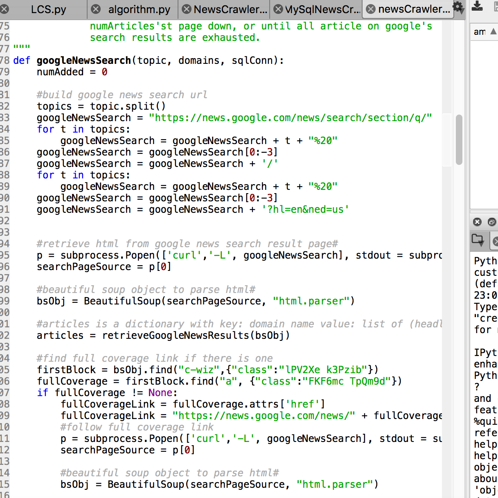

<div class="ui small rounded images">
  
  
</div>

Vacay is a web application that I helped create as a team project in ICS 415, Spring 2015. The project helped me learn how to design and implement a responsive web site.

```js
byte ADCRead(byte ch)
{
    word value;
    ADC1SC1 = ch;
    while (ADC1SC1_COCO != 1)
    {   // wait until ADC conversion is completed   
    }
    return ADC1RL;  // lower 8-bit value out of 10-bit data from the ADC
}
```

Source code is avaiable and being updated on [my github](https://github.com/dickensc/PolarizationOfInformation).


